# 💸 ExpenseFlow Ecosystem


**ExpenseFlow** es una plataforma integral de gestión de gastos corporativos diseñada para simplificar el proceso de reporte, aprobación y reembolso de gastos. Este repositorio contiene todo el ecosistema de la aplicación (Frontend & Backend).

---

## 🚀 Características Principales

### 📱 Frontend (React + Vite)
- **UI Moderna**: Diseño limpio y responsivo con TailwindCSS y Glassmorphism.
- **Roles de Usuario**: Dashboards diferenciados para Empleados y Administradores.
- **Reportes Visuales**: Gráficos interactivos y estadísticas de gastos.
- **Gestión en Tiempo Real**: Notificaciones y actulizaciones de estado inmediatas.

### ⚙️ Backend (NestJS)
- **Arquitectura Robusta**: Implementación de Repository y Strategy Patterns.
- **Validación Inteligente**: Reglas de negocio dinámicas según el tipo de gasto (Viajes, Comida, Equipo).
- **Seguridad**: Autenticación JWT y Guards por roles.
- **Base de Datos**: PostgreSQL con TypeORM y Docker support.

---

## 🏗️ Arquitectura del Proyecto

```mermaid
graph TD
    Client[📱 React Client] -->|REST API| Gateway[🛡️ API Gateway / Nginx]
    Gateway -->|HTTP| Backend[⚙️ NestJS Backend]
    Backend -->|TypeORM| DB[(🐘 PostgreSQL)]
    
    subgraph "Frontend Layer"
        Client
    end
    
    subgraph "Backend Layer"
        Backend
        DB
    end
```



---

## 🛠️ Instalación Rápida (Docker)

La forma más sencilla de levantar todo el entorno es utilizando **Docker Compose**.

1. **Clonar el repositorio**
   ```bash
   git clone https://github.com/tu-usuario/expenseflow.git
   cd gastos
   ```

2. **Iniciar servicios**
   Asegúrate de tener Docker corriendo y ejecuta:
   ```bash
   cd backend
   docker-compose up -d
   ```
   *Esto iniciará la base de datos PostgreSQL.*

3. **Backend Setup**
   ```bash
   cd backend
   npm install
   npm run start:dev
   ```

4. **Frontend Setup**
   ```bash
   cd ../frontend
   npm install
   npm run dev
   ```

---

## 🔧 Configuración Manual

### 1. Backend (`/backend`)

El servidor API principal.

- **Requisitos**: Node.js v18+, PostgreSQL.
- **Configuración**:
  Crea un archivo `.env` en `/backend` basado en el ejemplo del README del backend.
- **Comandos**:
  ```bash
  cd backend
  npm install
  npm run start:dev
  ```
- **Documentación Completa**: [Ver README Backend](./backend/README.md)

### 2. Frontend (`/frontend`)

La interfaz de usuario construida con React y Vite.

- **Requisitos**: Node.js v18+.
- **Configuración**:
  Si es necesario, ajusta la URL del API en los archivos de entorno.
- **Comandos**:
  ```bash
  cd frontend
  npm install
  npm run dev
  ```

---

## 👥 Usuarios de Prueba (Demo)

El sistema viene pre-cargado con usuarios para testing inmediato:

| Rol | Email | Password | Acceso |
|-----|-------|----------|--------|
| **Admin** | `admin@expenseflow.com` | `admin123` | Dashboard Admin, Aprobar/Rechazar, Reportes |
| **Empleado** | `employee@expenseflow.com` | `employee123` | Dashboard Empleado, Crear Gastos, Ver Estado |

---

## 🧪 Testing

Para ejecutar las pruebas en cada entorno:

**Backend:**
```bash
cd backend
npm run test
npm run test:e2e
```

**Frontend:**
```bash
cd frontend
npm run test
```

---

## 📄 Licencia

Este proyecto está bajo la licencia [MIT](LICENSE).

---

<p align="center">
  Hecho con ❤️ para ExpenseFlow
</p>
